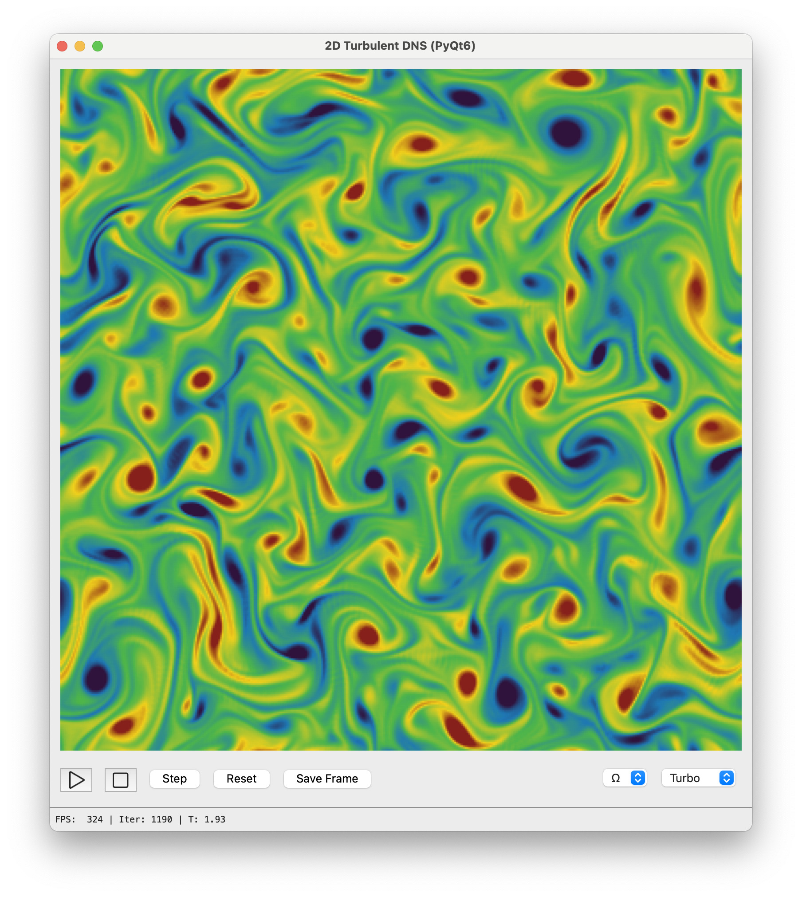

# PyDNS — 2D DNS Viewer (PyQt6 + Fortran)

A lightweight 2D Direct Numerical Simulation (DNS) visualizer using:

- **PyQt6** for the GUI  
- **NumPy + f2py** (Fortran) for the DNS solver  
- Runs on macOS  
- Optional `.app` bundle via PyInstaller  

---

## 🚀 Quick Install (macOS + gcc + uv)

### 1. Install system tools

```bash
brew install uv
brew install gcc
```

- `uv` — Fast Python package manager + virtualenv + runner  
- `gcc` — provides `gfortran` for the Fortran module  

### 2. Install Python and activate it

```bash
git clone git@github.com:mannetroll/pydns.git
cd pydns
uv python install 3.11.6
uv python pin 3.11.6
uv venv --python 3.11.6
source .venv/bin/activate
uv sync
```

---

## 🔧 Build the Fortran extension

If your solver file is `dns_driver_min.f`:

```bash
cd fortran
bash build_dns_macos.sh
```

This produces:

```
dns_fortran.cpython-311-darwin.so
```

---

## ▶ Run the DNS Viewer



```bash
uv run python main_min.py
```


---

## 🖥 Build a macOS `.app`

The project includes `pydns.spec`.

Build the bundle:

```bash
uv run pyinstaller pydns.spec
```

Produces:

```
dist/pydns.app
```

Double-click to launch.

---
